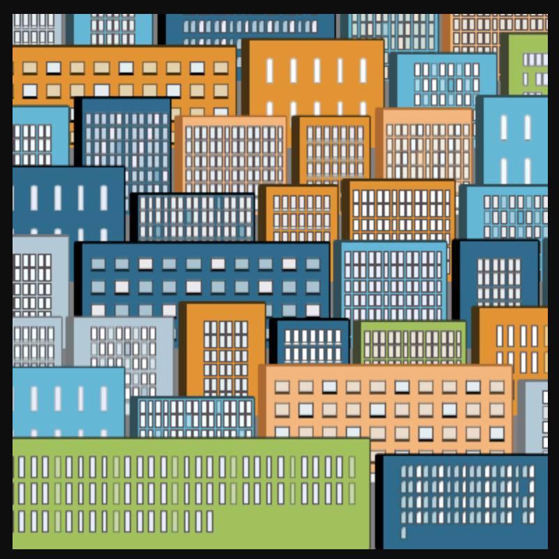

# CSS City Generator

This project generates unique generative cityscapes using CSS grid and JavaScript. The art style features a dynamic urban landscape with buildings of varying heights, styles, and window patterns.

  

## Art Description

The generative art algorithm creates layered city compositions with the following characteristics:

- Multiple rows of buildings (6-12 rows dynamically generated)
- Color palettes featuring complementary urban tones and window highlights
- Various building styles with different grid patterns and window arrangements
- Building heights determined by random parameters within controlled ranges
- Distinctive border effects that add depth to each building
- Dark background that creates a nighttime cityscape effect
- Responsive design that scales with viewport size

Each cityscape is uniquely generated based on:

- Random number of rows (6-12)
- Random selection from predefined color palettes
- Random building styles from 11 different variations
- Random window patterns and colors
- Dynamic building heights and widths

The result is a unique urban composition that creates an engaging cityscape while maintaining architectural coherence through controlled randomization.

## Usage

The cityscape regenerates automatically on:
- Page load
- Clicking the city canvas
- Clicking the regenerate button

The generator accepts optional parameters:
- Number of rows (default: random 6-12)
- City width (default: 19rem)
- City height (default: 27rem)
- Measuring unit (default: rem)

# base-city
# base-city
